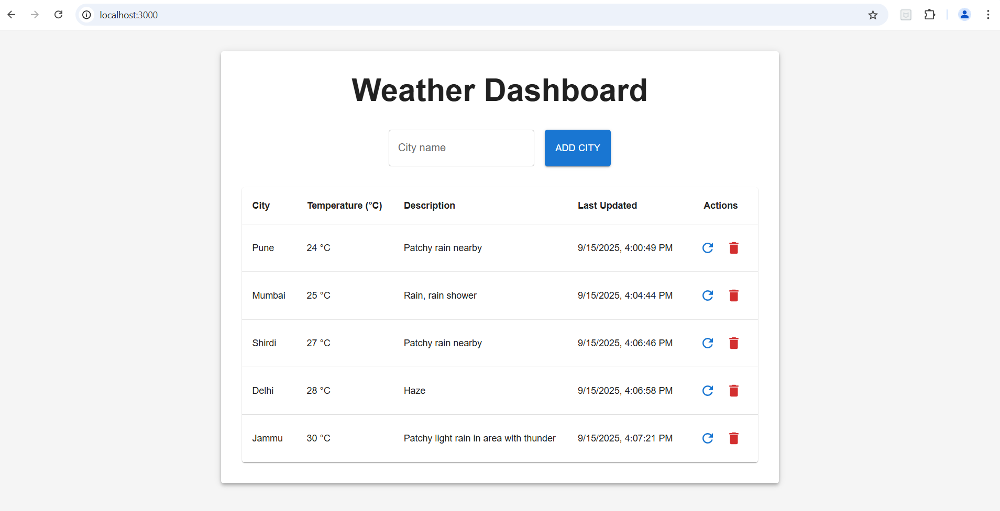

# A simple Weather App using [React.js](https://reactjs.org)

## Scripts

Install node modules

#### `npm install`

In the project directory, you can run:

#### `npm start`

Runs the app in the development mode. 
Open [http://localhost:3000](http://localhost:3000) to view it in the browser.

